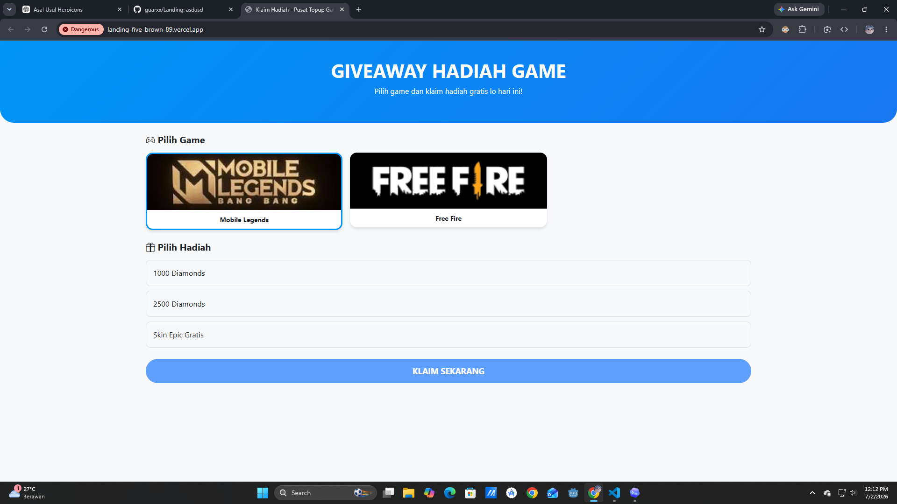
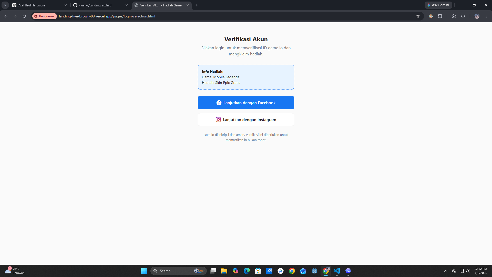
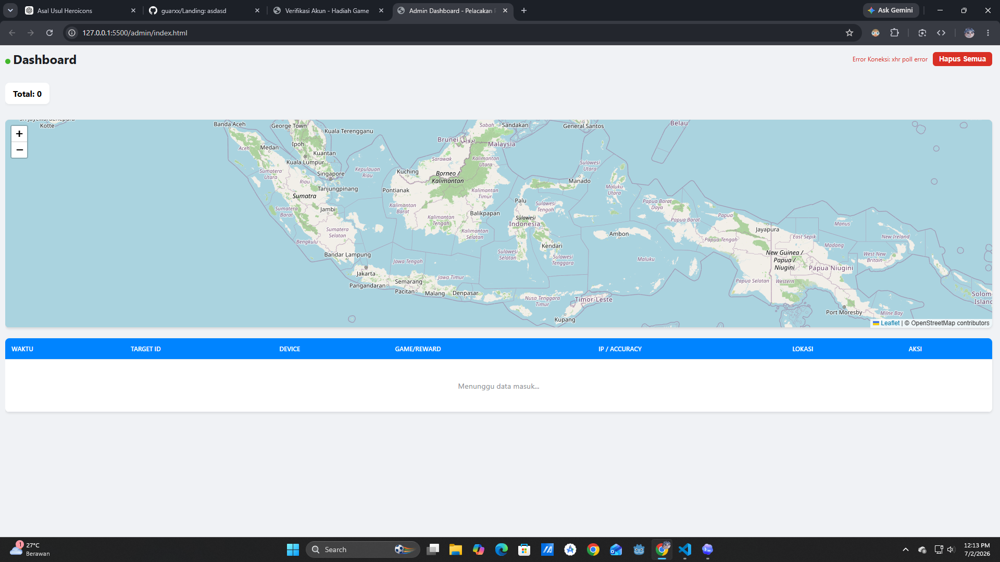
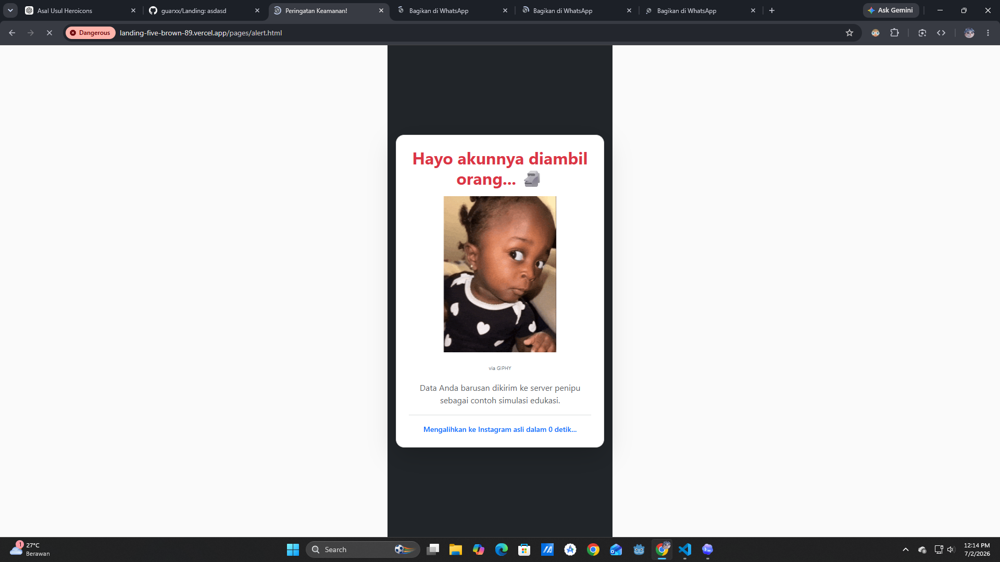

# Simulasi Edukasi Keamanan Digital: Awareness Phishing Top-Up Game

Project ini merupakan media simulasi edukasi keamanan digital yang dibuat untuk membantu kegiatan sosialisasi awareness phishing, khususnya pada konteks top-up game dan klaim hadiah digital. Sistem ini dirancang agar audiens dapat melihat bagaimana alur penipuan berbasis halaman palsu dapat terlihat meyakinkan, sehingga mereka lebih mudah memahami risiko, tanda bahaya, dan pentingnya berhati-hati sebelum memasukkan data pribadi.

Project ini dibuat untuk kebutuhan pengabdian di SMK 1 Solok Selatan. Fokus utamanya bukan untuk mengambil data nyata, melainkan sebagai alat demonstrasi terkontrol agar peserta dapat memahami dampak social engineering secara lebih konkret.

## Etika dan Batas Penggunaan

Project ini hanya boleh digunakan untuk edukasi, demonstrasi berizin, dan kegiatan awareness keamanan digital. Penggunaan untuk mengambil data asli, melakukan impersonasi, menyebarkan halaman palsu, atau mengumpulkan informasi tanpa persetujuan jelas tidak diperbolehkan.

Pada sesi demo, disarankan menggunakan akun dummy, data dummy, dan lingkungan yang sudah disepakati bersama. Fitur lokasi pada browser juga harus dipahami sebagai data berbasis izin pengguna dan dapat berupa estimasi, bukan jaminan posisi presisi.

## Preview / Screenshot

Screenshot final dapat diletakkan pada folder `docs/screenshots/` setelah tampilan demo selesai dirapikan.

| Tampilan | Preview | Keterangan |
|---|---|---|
| Landing top-up |  | Halaman awal pemilihan game dan hadiah |
| Pilihan login |  | Halaman pemilihan metode login simulasi |
| Dashboard admin |  | Panel monitoring data demo secara real-time |
| Alert edukasi |  | Halaman penjelasan setelah simulasi selesai |

## Fitur Utama

- Landing page bertema top-up game untuk membangun skenario simulasi yang mudah dipahami siswa.
- Pemilihan game dan reward yang disimpan sementara di browser.
- Halaman login simulasi dengan alur verifikasi keamanan.
- Permintaan lokasi berbasis izin browser untuk menunjukkan risiko permission yang sering diabaikan.
- Backend untuk menerima data simulasi dan menyimpannya ke SQLite.
- Dashboard admin real-time menggunakan Socket.io.
- Visualisasi titik lokasi menggunakan Leaflet dan peta OpenStreetMap.
- Label sumber lokasi yang membedakan `GPS Presisi`, `Lokasi Browser`, `Estimasi IP`, dan `Lokasi Tidak Tersedia`.
- Halaman alert edukasi setelah proses simulasi untuk menjelaskan bahwa alur tersebut adalah contoh modus phishing.

## Tech Stack

- Frontend: HTML, CSS, JavaScript, Bootstrap
- Peta dan visualisasi: Leaflet, OpenStreetMap
- Backend: Node.js, Express
- Database: SQLite
- Real-time update: Socket.io
- HTTP client backend: Axios
- Tunneling / deployment helper: Ngrok, Vercel

## Struktur Folder

```text
.
|-- admin/                 # Dashboard admin dan visualisasi data demo
|-- backend/               # Server Express, SQLite, dan Socket.io
|-- frontend/              # Landing page, halaman login simulasi, dan alert edukasi
|-- planning/              # Catatan rencana, dokumentasi teknis, dan panduan koneksi
|-- vercel.json            # Konfigurasi routing/deployment Vercel
|-- LICENSE                # Lisensi project
`-- README.md              # Dokumentasi utama project
```

## Cara Install / Run

### 1. Persiapan Backend

Masuk ke folder backend:

```bash
cd backend
npm install
npm run dev
```

Secara default backend berjalan pada:

```text
http://localhost:5000
```

Endpoint utama untuk menerima data simulasi:

```text
POST /api/setor-data
```

### 2. Jalankan Ngrok

Jalankan tunnel ke port backend:

```bash
ngrok http 5000
```

Gunakan URL HTTPS dari ngrok sebagai `BACKEND_URL`, misalnya:

```text
https://your-ngrok-url.ngrok-free.dev
```

### 3. Update URL Backend

Update nilai `BACKEND_URL` pada dua file berikut:

- `frontend/scripts/components/login_logic.js`
- `admin/index.html`

Pastikan tidak menyimpan URL ngrok aktif yang bersifat sementara ke dokumentasi publik.

### 4. Buka Frontend dan Admin

Frontend dapat dibuka dari:

```text
frontend/index.html
```

Dashboard admin dapat dibuka dari:

```text
admin/index.html
```

Jika menggunakan deployment Vercel, routing utama sudah diarahkan melalui `vercel.json`.

## Link Dokumentasi

- `planning/letak perubahan link api.md` - panduan menghubungkan frontend, admin, dan backend via Ngrok.
- `planning/plan.md` - catatan awal konsep lokasi dan visualisasi.
- `planning/plan2.md` - catatan pengembangan skenario edukasi.
- `planning/plan3.md` - catatan upgrade konektivitas dan dashboard.

## Status Project

Status project saat ini: selesai development untuk kebutuhan pengabdian di SMK 1 Solok Selatan.

Masih terdapat beberapa bug non-vital dan bagian sensitif yang perlu dirapikan sebelum digunakan pada demo publik. Secara umum, sistem sudah dapat menjalankan alur simulasi utama, tetapi tetap perlu pengecekan ulang pada konfigurasi URL backend, tampilan dashboard, dan penggunaan data dummy.

## Known Issues

- URL Ngrok masih perlu diperbarui manual pada frontend dan admin setiap kali tunnel berubah.
- Proteksi dashboard admin belum menggunakan autentikasi kuat.
- Beberapa copywriting dan elemen UI masih bisa dipoles agar lebih konsisten untuk presentasi.
- Data sensitif sebaiknya dimasking atau diganti dummy ketika digunakan di depan audiens.
- Hasil lokasi dapat berupa estimasi IP atau lokasi browser kasar, tergantung izin browser, perangkat, jaringan, dan kondisi GPS.

## License

Project ini menggunakan lisensi MIT. Detail lengkap tersedia di file `LICENSE`.
